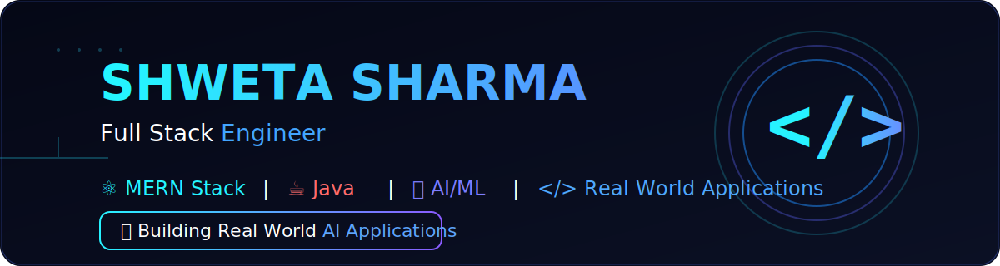

<div align="center">



# 👋 Hi, I'm Shweta Sharma

### 🚀 Full Stack AI Developer | AI/ML Enthusiast | MERN Stack

<p>

</p>

<p>


</p>

</div>

---

# 💠 SYSTEM OVERVIEW

```yaml
Name      : Shweta Sharma
Username  : Shweta30-90
Role      : Full Stack AI Developer
Learning  : MERN + AI/ML
Backend   : FastAPI, Node.js
Frontend  : React
Database  : MongoDB, MySQL
Goal      : Software Engineer
```

---

# ⚡ CURRENT MISSION

- 🚀 Building AI Financial Fraud Detection System
- 💻 Improving DSA & Development Skills
- 🤖 Learning Machine Learning
- 🌍 Creating Placement Ready Projects

---
# 🛠️ TECH STACK

<div align="center">

| Category | Technologies |
|----------|--------------|
| 💻 Languages | Python • Java • JavaScript |
| 🎨 Frontend | React • HTML • CSS • Tailwind CSS |
| ⚙ Backend | Node.js • Express • FastAPI |
| 🤖 AI / ML | Scikit-learn • Pandas • NumPy |
| 🗄 Database | MongoDB • MySQL |
| 🛠 Tools | Git • GitHub • VS Code • Postman |

</div>

---

# 📊 GITHUB DASHBOARD

<p align="center">


</p>

<p align="center">


</p>

---

# 🏆 GITHUB TROPHIES

<p align="center">


</p>

---

# 📈 CONTRIBUTION GRAPH

<p align="center">


</p>

---

# 🚀 FEATURED PROJECTS

### 🤖 AI Financial Fraud Detection System
- 🔹 MERN Stack + FastAPI + Machine Learning
- 🔹 Real-time Fraud Detection
- 🔹 Interactive Dashboard
- 🔹 AI Risk Prediction


---

# 🎯 2026 GOALS

- ✅ Crack Product Based Company
- ✅ Master MERN Stack
- ✅ Build 10+ AI Projects
- ✅ Open Source Contributor
- ✅ Solve 500+ DSA Problems

---

# 📫 CONNECT WITH ME

<p align="center">

<a href="https://github.com/Shweta30-90">

</a>

<a href="https://linkedin.com/in/shweta-sharma-3b407b295">

</a>

<a href="mailto:ss7390002L@gmail.com">

</a>

</p>

---

<div align="center">

## 💻 "Code • Learn • Build • Repeat"

⭐ Thanks for visiting my profile!


</div>
